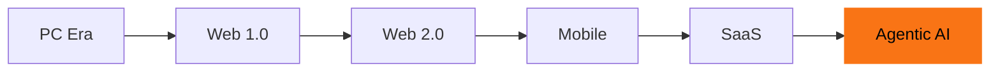

I've been thinking about solo dev like the stock market. The question isn't what should I build. It's what era are we in.

A mediocre surfer on a big wave beats a great surfer on flat water. Picking the right era matters more than being the best coder.

So I did the research before touching the next project.

## The Era Chart

We're in the Agentic AI era. Not a hype cycle. A structural shift in what software is.

Software used to be a tool you pick up and put down. Now it acts for you. That changes everything about what people will pay for and who can build it.

The macro trend is confirmed. The question is where we are on the curve. The answer: past the hype, entering the build phase. This is when real money gets made. Not during the frenzy. Right after it settles.

## What's Commoditized

ChatGPT wrapper plays are over. Less obvious: dev speed is also commoditized now.

A year ago the edge was shipping fast. In 2026, every solo dev can ship a working app in an hour with AI. Speed is the floor, not the ceiling.

## What's Ascending

Customers don't want tools. They want results.

  You describe the problem. Something hands you the answer. Not a tool to figure out — the answer
  itself.

Not software you operate. An outcome you receive. You describe the problem. Something hands you the answer.

The competitive edge right now isn't speed. It's distribution. Being known, trusted, and findable before you launch. The builder who wins has an audience, not the fastest IDE.

## What I Actually Did

I wrote a thesis doc. One page. My bet on the world, first-person, dated March 2026.

Then I updated the site to match. The hero changed: "Describe the problem. Get back the answer." The about page is a full rewrite. The model section now explains pipelines and owning the system, not 48-hour sprints.

The context and principles docs got updated too. Those are internal, but they shape every decision I make in this codebase.

## What I Don't Know Yet

Which specific industry or profession I'm building for at scale. That's not a thesis question. That's a strategy question. And you can't write that doc until you have signal.

Right now I have zero users. Zero revenue. That's the honest state of things.

The thesis doesn't fix that. It just makes sure every build decision from here is pointed at the right era, not the last one.
