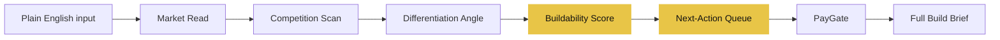

Every validation framework I’ve seen hands you another thing to fill out.

Five competitors, three market size estimates, a SWOT grid. You read it, nod, and still don’t know what to actually build this week.

<!-- TODO: fill in narrative — why this frustration now? was there a specific moment? -->

## What shipped

- The project is live as a repository — context, brand tokens, and the full pipeline design are locked in
- Landing page is wired with a proof panel: a real example discovery run hardcoded above the fold, so the first thing you see is example output, not a feature list
- Discovery pipeline designed: five stages (market read, competition scan, differentiation angle, buildability score, brief generation) streaming through Claude — free tier stops at the score + next-action queue, $9 unlocks the full build brief
- Ran a live validation pass — four real competitors confirmed, YC Spring 2026 RFS verified, Reddit pain signal strong across r/indiehackers and r/Entrepreneur

<!-- TODO: fill in narrative — any surprises during the validation pass? what did the competitor research reveal that changed the design? -->

## Why

The gap isn’t market research — every tool does that. The gap is the last mile: what do I actually do this week?

Four active competitors — WorthBuild, IdeaProof, ValidateMySaaS, ProductGapHunt — all hand you an analysis. None of them hand you a this-week action list. That’s the gap.

The verdict and the to-do list are free. The brief is the unlock.

<!-- TODO: fill in narrative — what made you believe this was the right thing to build right now? was it the YC RFS? the competitor gap? something else? -->

## What's next

Building the /discover route — the single text input, streaming pipeline, score card, and PayGate wired end to end.
