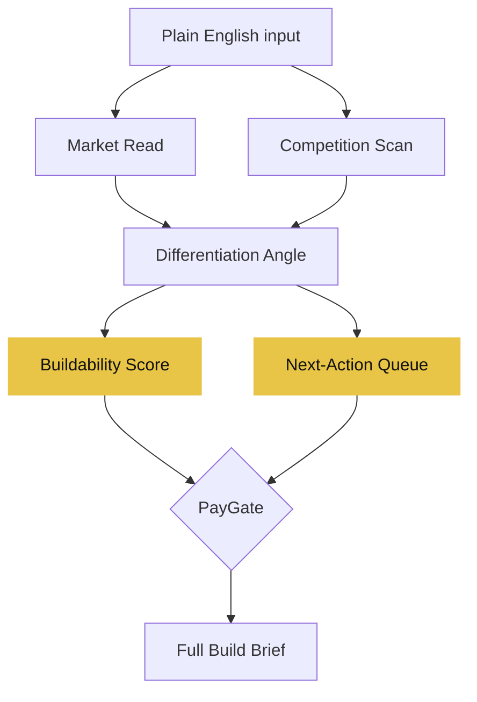

I have three ideas open in tabs right now.

That is the actual problem. Not a shortage of ideas. No system for knowing which one is real.

## The idea

One input. You describe a frustration or an idea in plain English. The tool runs the full validation pipeline (market read, competition scan, differentiation angle, buildability score) and hands back a verdict and a this-week action list. Not a report to decode. A decision, plus what to do next if the answer is yes.

The free output is the verdict: a score 1-10, the reasoning behind it, and three concrete tasks for this week. The $9 unlock is the full build brief: a shareable one-pager with market positioning, brand direction, and a route plan.

## Why this exists

Four tools already do idea validation: WorthBuild, IdeaProof, ValidateMySaaS, ProductGapHunt. I checked all four. Every one of them hands you an analysis: competitor features, market size estimates, risk scores. None of them hand you a to-do list.

The top complaint across every competitor: "I get a report, but I still don't know what to actually do next."

That is the gap. The output that matters is not the market size number. It is: which subreddit do I post in first, which two competitors should I read reviews for, which piece of the money loop do I wire this week.

## What's next

Building the /discover route. The single text input that kicks off the full streaming pipeline. That is the whole product. Everything else is scaffolding.
