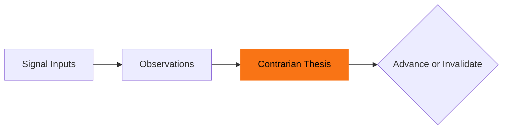

Every day I read HN, Product Hunt, Reddit, Indie Hackers. I notice patterns. I don't write them down. Three weeks later I couldn't tell you what I learned.

The inputs were there. The synthesis wasn't.

## The three columns

I built a dashboard to fix it. Three columns.

Left: signal inputs. You log what you see: title, source, category, optional notes. The categories are: trends and emerging signals, pain and complaints, indie builder activity, raw search data. Quick-access links to the six sources I hit every day sit above the feed so the tab is right there when you're consuming.

Middle: observations. Not individual inputs. Patterns. One level of abstraction up from what you logged. "I keep seeing this same complaint across three different communities."

Right: contrarian theses. This is the column that matters.

[Peter Thiel](https://en.wikipedia.org/wiki/Peter_Thiel) asks: what do you know that most people think is false? That's the question a contrarian thesis has to answer. Not "this seems interesting." A belief. Stated plainly, with a conviction level from 1 (hunch) to 5 (certain). You advance it as evidence mounts. You invalidate it when you're wrong.

The header has a daily prompt that rotates through seven variations: "Where is something growing fast but being served poorly?" It sets the lens before you start reading.

## What's actually built

Full-stack Next.js, Neon Postgres, SWR polling across all three columns. Full CRUD for inputs, observations, and theses. A 14-day streak tracker in the header: days with five or more inputs show full color, dimmer for less, grey for nothing.

Most of it was built with Vercel v0 in one session. I reviewed the output today and found one real bug: every API route imports the database client as a default import when the export is named. That's the whole app broken silently. v0 gets you 90% there fast. The last 10% needs a real eye on it.

## What it's for

Not a product. Personal tool.

[The thesis doc I wrote last week](/log/2026-03-18-the-era-thesis) has a decision sequence: Observe, Validate, Filter, Build. The first step needs a home that isn't a Notion page nobody opens.

One sits in Notion. The other runs every day.
