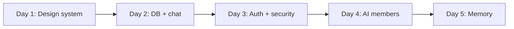

Modryn has five AI team members. Charlie Munger owns strategy. Steve Jobs owns product. Marc Lou owns execution. Michelle Lim owns engineering. Dieter Rams owns design.

Each has a system prompt built from their actual worldview: speeches, interviews, writing, documented decision frameworks. They know each other exists. They remember previous sessions.

I built the first working version in five days.

<!-- TODO: fill in narrative -->

## What shipped

- Five AI members are live, each with a distinct system prompt drawn from real source material
- Streaming chat persists to Neon DB. Conversations survive a reload.
- Every conversation is summarized by a background model and injected into the next session. Memory is durable across conversations.
- The app is invite-gated. Current user count: one.

<!-- TODO: fill in narrative -->

## Why

I needed people who would push back, not agree. Every AI assistant I tried defaulted to encouragement. I wanted the experience of a team with real opinions that remembered what I said last week.

Every AI assistant I tried defaulted to encouragement. I wanted the experience of a team with real opinions that remembered what I said last week.

<!-- TODO: fill in narrative -->

## What's next

Customer discovery: post this story, see who reaches out, ask about their decision-making process before showing them anything.

<!-- TODO: fill in narrative -->
